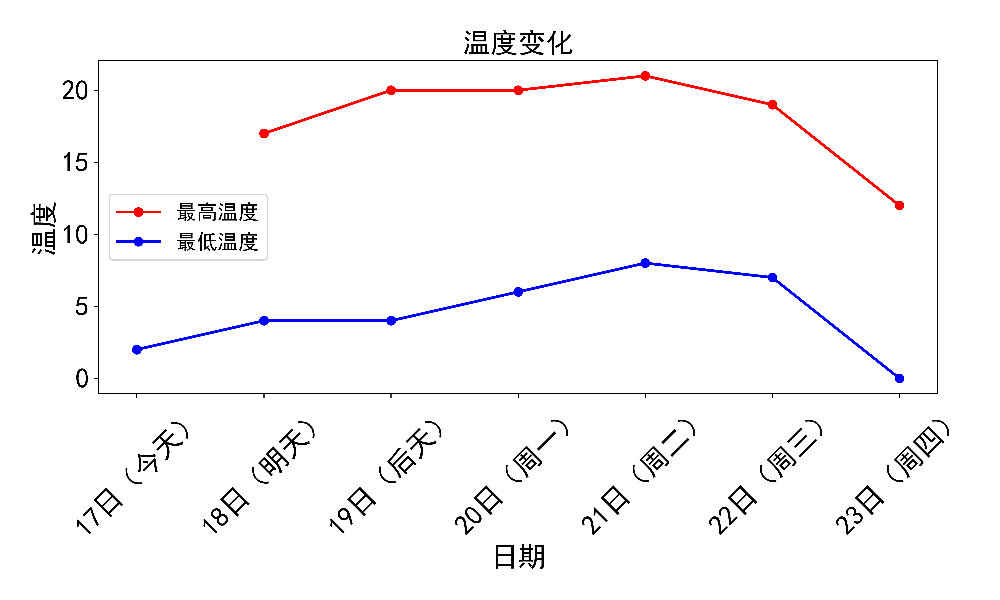
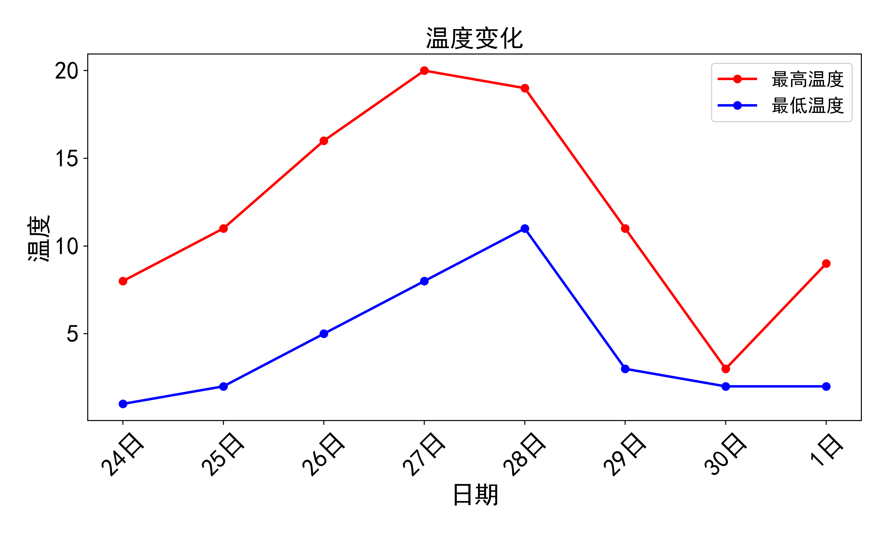
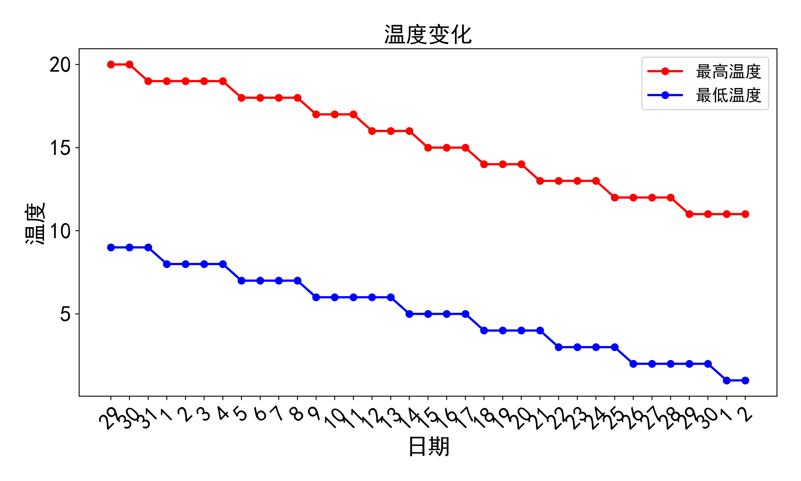

# 文件说明

- `Funcs.py`：包含了爬虫、数据处理、数据可视化等函数
- `main.py`：主函数，用于调用`Funcs.py`中的函数
- `Input.py`：定义了一些全局变量
- `Mylibs.py`: 需要用到的库
- `chromedriver.exe`：selenium需要用到的驱动 (版本号：119.0.6045.160)

# 函数说明

在获取网页的时候，考虑到目标网页（[中国天气网](http://www.weather.com.cn/weather1d/101181608.shtml)）的特殊性，采用了两种获取方式，对应`Funcs.py`文件中的两个函数：

- `get_html_by_request()`：使用requests获取网页
- `get_html_by_selenium()`：使用selenium获取网页，需要安装chrome浏览器和对应的chrome，可以在[这里](https://googlechromelabs.github.io/chrome-for-testing/)下载对应的版本。

这是由于中国天气网的部分数据是通过JavaScript动态加载的，而Beautiful Soup仅能解析静态HTML内容，它不能执行或解析JavaScript，因此无法获取到通过JavaScript动态加载的数据；selenium可以模拟浏览器的行为，可以获取到动态加载的数据。

# 结果

